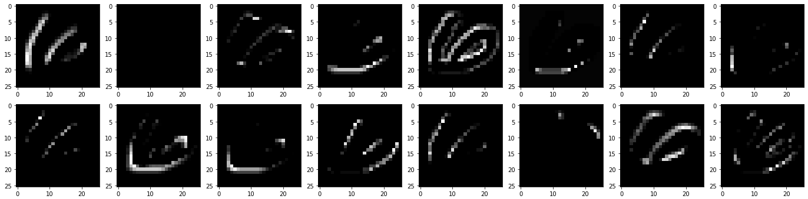

# MNIST Digit Classification using Convolutional Neural Network

This repository demonstrates the use of **Convolutional Neural Networks (CNN)** to classify handwritten digits from the **MNIST dataset**.

The repository contains several notebooks that perform different tasks:

1. **Digit Classification with CNN**: A notebook that classifies MNIST digits using a CNN built with the **Sequential Model** of **Keras**.
2. **Visualization of Hidden Layers**: A separate notebook visualizing the **outputs of hidden layers** in the CNN model using the **Functional Model** of **Keras**, helping to understand how the model processes and classifies the input data.

### Technologies Used:
- Python
- **Keras** (with TensorFlow backend)
- **Matplotlib** (for visualizations)
- **NumPy** & **Pandas** (for data manipulation)

---

Feel free to explore the notebooks, run them, and experiment with the models!
